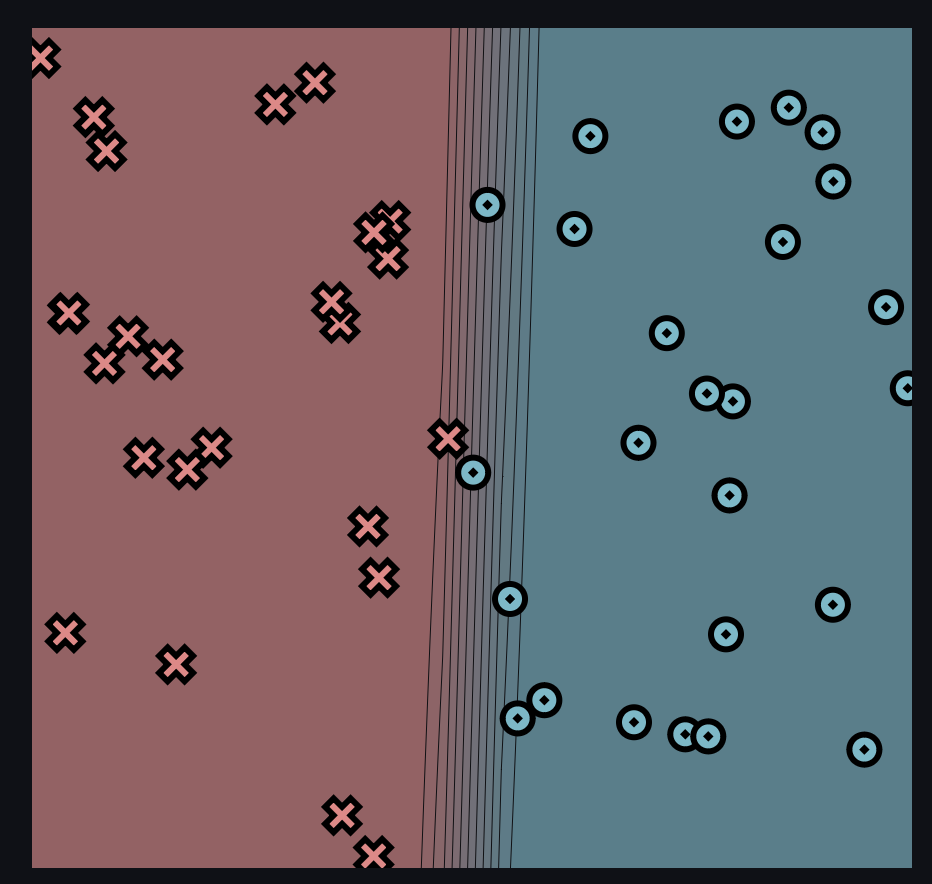
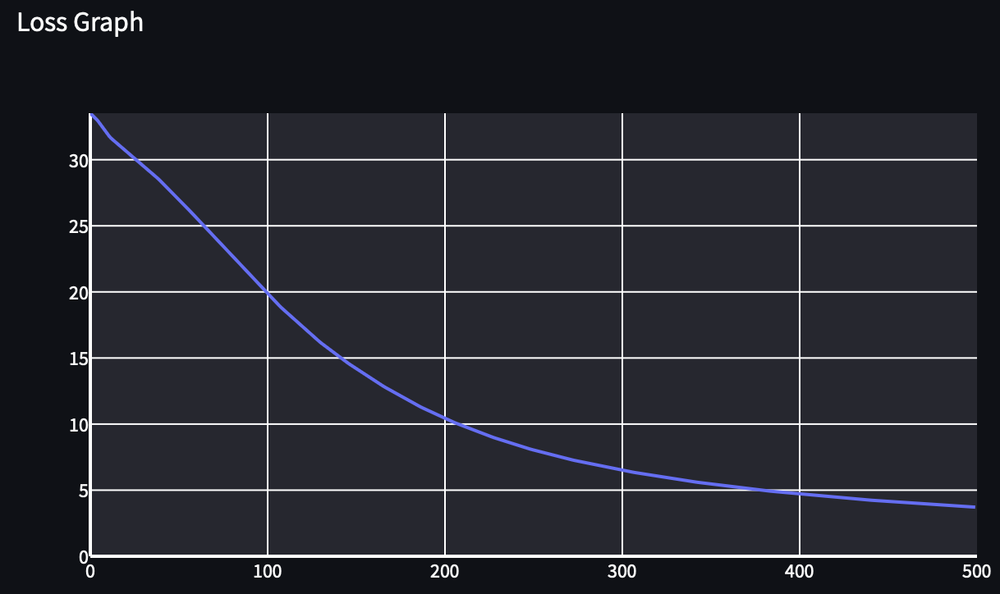
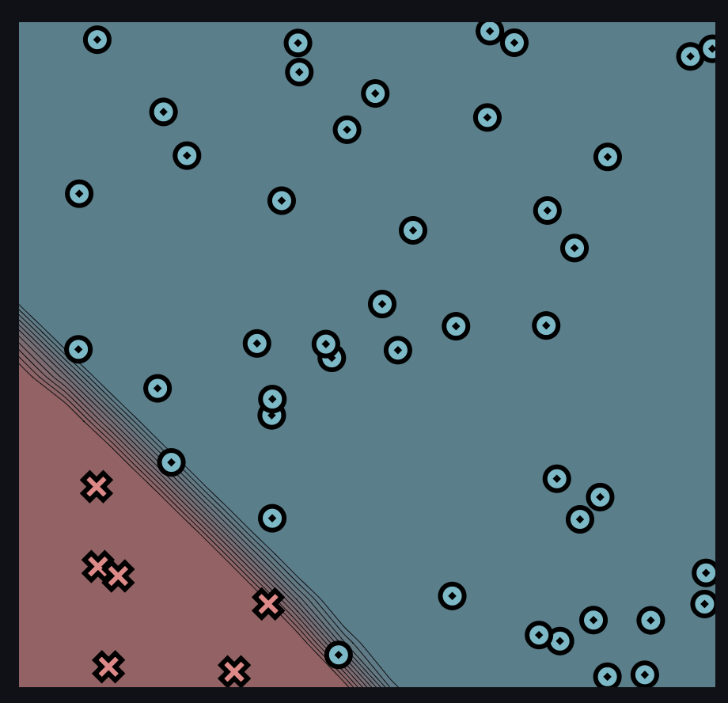
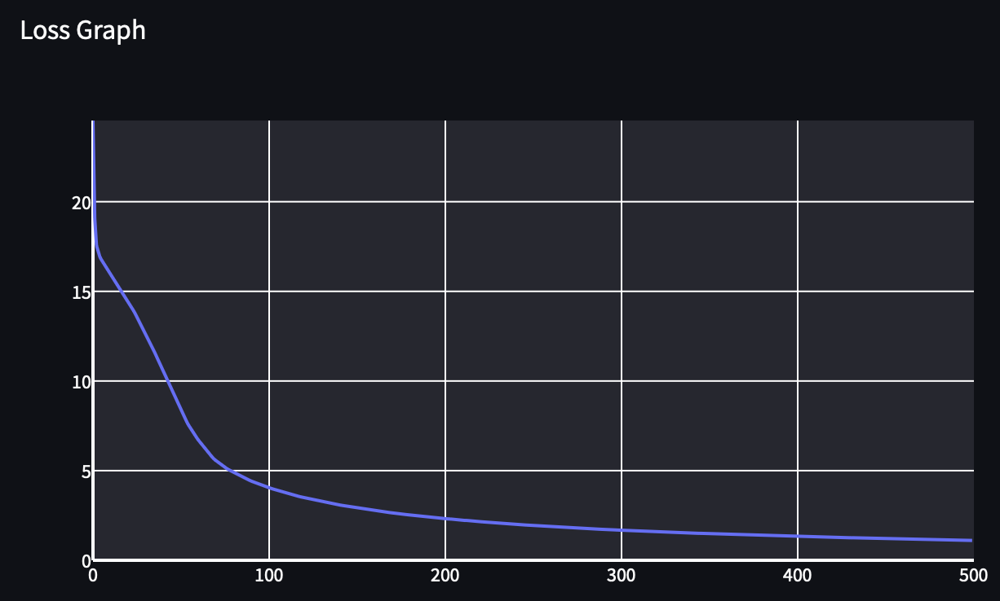
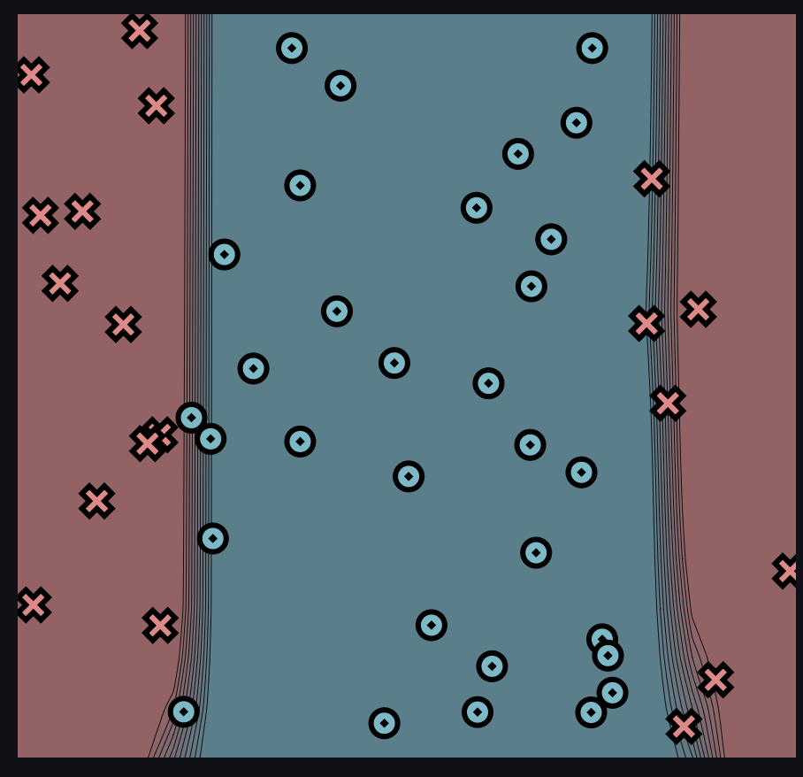
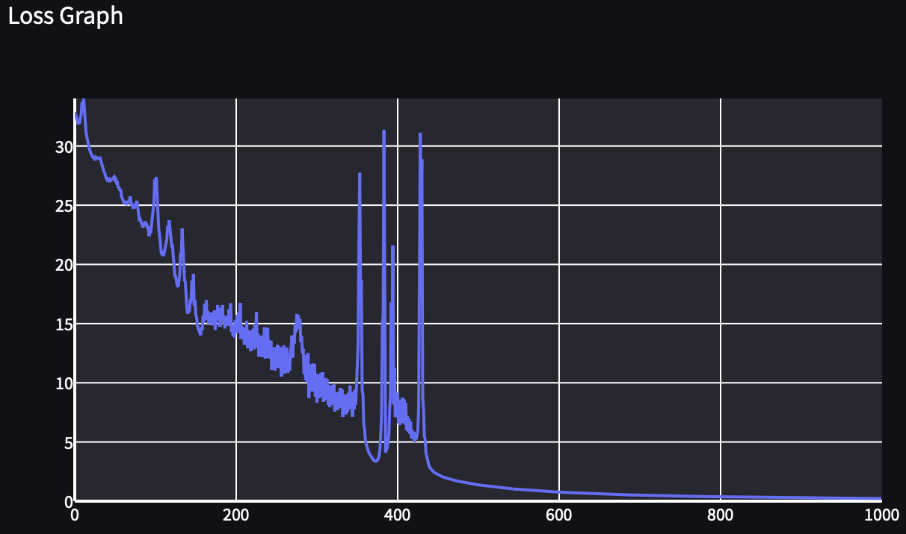
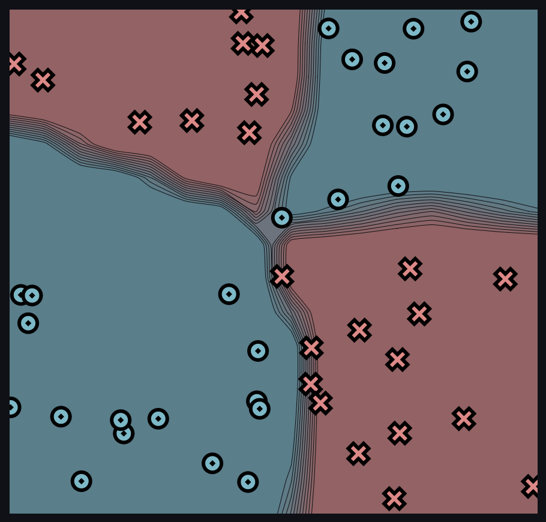
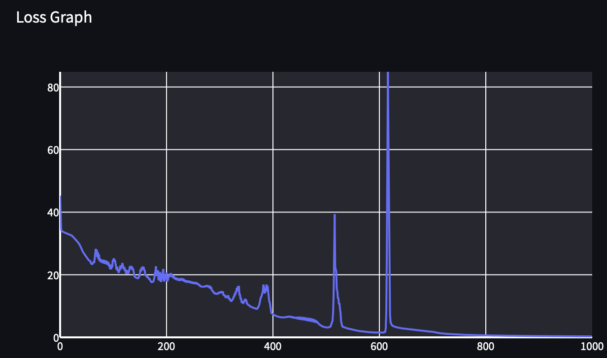

[](https://classroom.github.com/a/YFgwt0yY)
# MiniTorch Module 2


* Docs: https://minitorch.github.io/

* Overview: https://minitorch.github.io/module2/module2/

This assignment requires the following files from the previous assignments. You can get these by running

```bash
python sync_previous_module.py previous-module-dir current-module-dir
```

The files that will be synced are:

        minitorch/operators.py minitorch/module.py minitorch/autodiff.py minitorch/scalar.py minitorch/scalar_functions.py minitorch/module.py project/run_manual.py project/run_scalar.py project/datasets.py


## Task 2.5: Training (output training logs and final images)

### Dataset: Simple
###### Arguments/Parameters Inputted:
        - Number of points: 50
        - Size of hidden layer: 2
        - Learning Rate: 0.1
        - Number of epochs: 500
###### Time per epoch reported by the trainer:
        - Epoch 500/500. Time per epoch: 0.048s. Time left: 0.00s.

###### Output traning logs - Epoch Results:
- Epoch: 0/500, loss: 0, correct: 0
- Epoch: 10/500, loss: 32.02655382232982, correct: 25
- Epoch: 20/500, loss: 30.84613795875095, correct: 25
- Epoch: 30/500, loss: 29.707249654244865, correct: 36
- Epoch: 40/500, loss: 28.464741504823568, correct: 36
- Epoch: 50/500, loss: 27.131633117247745, correct: 41
- Epoch: 60/500, loss: 25.718382519562606, correct: 43
- Epoch: 70/500, loss: 24.257856249313868, correct: 45
- Epoch: 80/500, loss: 22.799724981319677, correct: 45
- Epoch: 90/500, loss: 21.361701231020284, correct: 45
- Epoch: 100/500, loss: 19.959903113769613, correct: 45
- Epoch: 110/500, loss: 18.647014181469256, correct: 45
- Epoch: 120/500, loss: 17.422965867423024, correct: 45
- Epoch: 130/500, loss: 16.26248686236595, correct: 46
- Epoch: 140/500, loss: 15.224718394112099, correct: 46
- Epoch: 150/500, loss: 14.26712137263109, correct: 47
- Epoch: 160/500, loss: 13.38343921601278, correct: 46
- Epoch: 170/500, loss: 12.564245919740564, correct: 47
- Epoch: 180/500, loss: 11.808234902519132, correct: 47
- Epoch: 190/500, loss: 11.113058815866655, correct: 47
- Epoch: 200/500, loss: 10.483550073083064, correct: 48
- Epoch: 210/500, loss: 9.91179826745682, correct: 49
- Epoch: 220/500, loss: 9.388236366351267, correct: 50
- Epoch: 230/500, loss: 8.908972903962725, correct: 50
- Epoch: 240/500, loss: 8.470239964772034, correct: 50
- Epoch: 250/500, loss: 8.071170324453613, correct: 50
- Epoch: 260/500, loss: 7.708076898942008, correct: 50
- Epoch: 270/500, loss: 7.37645698551632, correct: 50
- Epoch: 280/500, loss: 7.071308971716348, correct: 50
- Epoch: 290/500, loss: 6.789818271599644, correct: 50
- Epoch: 300/500, loss: 6.5294798741748545, correct: 50
- Epoch: 310/500, loss: 6.28807747480428, correct: 50
- Epoch: 320/500, loss: 6.063667342100587, correct: 50
- Epoch: 330/500, loss: 5.854539099808223, correct: 50
- Epoch: 340/500, loss: 5.65917886370185, correct: 50
- Epoch: 350/500, loss: 5.476276309536819, correct: 50
- Epoch: 360/500, loss: 5.304682348185712, correct: 50
- Epoch: 370/500, loss: 5.1434266375016575, correct: 50
- Epoch: 380/500, loss: 4.99158895209129, correct: 50
- Epoch: 390/500, loss: 4.848364868290251, correct: 50
- Epoch: 400/500, loss: 4.713057722524138, correct: 50
- Epoch: 410/500, loss: 4.586353084459631, correct: 50
- Epoch: 420/500, loss: 4.469221493701448, correct: 50
- Epoch: 430/500, loss: 4.3586108172615345, correct: 50
- Epoch: 440/500, loss: 4.253408085624847, correct: 50
- Epoch: 450/500, loss: 4.153230657779675, correct: 50
- Epoch: 460/500, loss: 4.057733814272181, correct: 50
- Epoch: 470/500, loss: 3.9666057036547624, correct: 50
- Epoch: 480/500, loss: 3.8795631351649615, correct: 50
- Epoch: 490/500, loss: 3.7963480289571887, correct: 50
- Epoch: 500/500, loss: 3.7167244119757115, correct: 50

##### Module 2.5 Final Visualization Image for Simple Dataset Data Point Plot:

##### Module 2.5 Final Visualization Image for Simple Dataset Loss Graph:



### Dataset: Diag
###### Arguments/Parameters Inputted:
        - Number of points: 50
        - Size of hidden layer: 6
        - Learning Rate: 0.5
        - Number of epochs: 500
###### Time per epoch reported by the trainer:
        - Epoch 500/500. Time per epoch: 0.159s. Time left: 0.00s.

###### Output traning logs - Epoch Results:
- Epoch: 0/500, loss: 0, correct: 0
- Epoch: 10/500, loss: 16.14479871850958, correct: 44
- Epoch: 20/500, loss: 14.610208132832987, correct: 44
- Epoch: 30/500, loss: 12.810007051883474, correct: 44
- Epoch: 40/500, loss: 10.723945309570412, correct: 44
- Epoch: 50/500, loss: 8.577564427308426, correct: 45
- Epoch: 60/500, loss: 6.818778012733327, correct: 47
- Epoch: 70/500, loss: 5.618643495932042, correct: 48
- Epoch: 80/500, loss: 4.942217200262921, correct: 49
- Epoch: 90/500, loss: 4.45240640184804, correct: 49
- Epoch: 100/500, loss: 4.0811010856776395, correct: 49
- Epoch: 110/500, loss: 3.7645849850934003, correct: 49
- Epoch: 120/500, loss: 3.511455650913086, correct: 49
- Epoch: 130/500, loss: 3.293366170529615, correct: 49
- Epoch: 140/500, loss: 3.1015343922557888, correct: 49
- Epoch: 150/500, loss: 2.934143281165097, correct: 49
- Epoch: 160/500, loss: 2.785399774975528, correct: 49
- Epoch: 170/500, loss: 2.6520725455820973, correct: 49
- Epoch: 180/500, loss: 2.536155940996286, correct: 49
- Epoch: 190/500, loss: 2.4263736334898174, correct: 49
- Epoch: 200/500, loss: 2.3297936013129408, correct: 49
- Epoch: 210/500, loss: 2.2409482542656356, correct: 49
- Epoch: 220/500, loss: 2.158779307359855, correct: 49
- Epoch: 230/500, loss: 2.082505756116018, correct: 49
- Epoch: 240/500, loss: 2.0105919157494117, correct: 49
- Epoch: 250/500, loss: 1.944600494620306, correct: 49
- Epoch: 260/500, loss: 1.8852480188339984, correct: 49
- Epoch: 270/500, loss: 1.8286455684728755, correct: 49
- Epoch: 280/500, loss: 1.7776369094926023, correct: 50
- Epoch: 290/500, loss: 1.7336493683759016, correct: 49
- Epoch: 300/500, loss: 1.6794296601350787, correct: 50
- Epoch: 310/500, loss: 1.6371076035638752, correct: 50
- Epoch: 320/500, loss: 1.5975636051888498, correct: 50
- Epoch: 330/500, loss: 1.5559573154423298, correct: 50
- Epoch: 340/500, loss: 1.5243026345853792, correct: 50
- Epoch: 350/500, loss: 1.4861865707106858, correct: 50
- Epoch: 360/500, loss: 1.4524369328301747, correct: 50
- Epoch: 370/500, loss: 1.4249948499970142, correct: 50
- Epoch: 380/500, loss: 1.3892431378325447, correct: 50
- Epoch: 390/500, loss: 1.3632713784378179, correct: 50
- Epoch: 400/500, loss: 1.3388541587766831, correct: 50
- Epoch: 410/500, loss: 1.3086795958612398, correct: 50
- Epoch: 420/500, loss: 1.2861020132061536, correct: 50
- Epoch: 430/500, loss: 1.258668248558407, correct: 50
- Epoch: 440/500, loss: 1.2382932330762064, correct: 50
- Epoch: 450/500, loss: 1.212342308313577, correct: 50
- Epoch: 460/500, loss: 1.1938306208539171, correct: 50
- Epoch: 470/500, loss: 1.1678208929903875, correct: 50
- Epoch: 480/500, loss: 1.147454410854143, correct: 50
- Epoch: 490/500, loss: 1.1249332825996783, correct: 50
- Epoch: 500/500, loss: 1.1061710551087338, correct: 50

##### Module 2.5 Final Visualization Image for Diagonal Dataset Data Point Plot:

##### Module 2.5 Final Visualization Image for Diagonal Dataset Loss Graph:



### Dataset: Split
###### Arguments/Parameters Inputted:
        - Number of points: 50
        - Size of hidden layer: 10
        - Learning Rate: 0.5
        - Number of epochs: 1000
###### Time per epoch reported by the trainer:
Epoch 1000/1000. Time per epoch: 0.331s. Time left: 0.00s.

###### Output traning logs - Epoch Results:
- Epoch: 0/1000, loss: 0, correct: 0
- Epoch: 10/1000, loss: 33.69887811537102, correct: 31
- Epoch: 20/1000, loss: 29.566861358416972, correct: 35
- Epoch: 30/1000, loss: 29.063586645711776, correct: 35
- Epoch: 40/1000, loss: 27.280842388375234, correct: 39
- Epoch: 50/1000, loss: 27.39207818622827, correct: 37
- Epoch: 60/1000, loss: 25.56993672192727, correct: 40
- Epoch: 70/1000, loss: 25.735908140727037, correct: 39
- Epoch: 80/1000, loss: 24.59788590423207, correct: 39
- Epoch: 90/1000, loss: 23.38920832773695, correct: 40
- Epoch: 100/1000, loss: 27.22627617453335, correct: 36
- Epoch: 110/1000, loss: 20.895941938853234, correct: 41
- Epoch: 120/1000, loss: 23.176836034312032, correct: 38
- Epoch: 130/1000, loss: 18.726761596526252, correct: 40
- Epoch: 140/1000, loss: 16.148471659783343, correct: 42
- Epoch: 150/1000, loss: 16.985648539654747, correct: 40
- Epoch: 160/1000, loss: 15.665853701774468, correct: 42
- Epoch: 170/1000, loss: 15.91629383482858, correct: 41
- Epoch: 180/1000, loss: 16.32935166142614, correct: 41
- Epoch: 190/1000, loss: 15.637841961898971, correct: 41
- Epoch: 200/1000, loss: 15.297003875850953, correct: 42
- Epoch: 210/1000, loss: 14.623228980199203, correct: 42
- Epoch: 220/1000, loss: 14.258264486909288, correct: 42
- Epoch: 230/1000, loss: 13.435790561124083, correct: 42
- Epoch: 240/1000, loss: 14.634267723523038, correct: 42
- Epoch: 250/1000, loss: 12.634960495416777, correct: 43
- Epoch: 260/1000, loss: 13.145197503431262, correct: 43
- Epoch: 270/1000, loss: 13.996875261737, correct: 42
- Epoch: 280/1000, loss: 15.372004685754947, correct: 42
- Epoch: 290/1000, loss: 12.525944631899305, correct: 43
- Epoch: 300/1000, loss: 10.74819002521422, correct: 44
- Epoch: 310/1000, loss: 10.146517193399783, correct: 44
- Epoch: 320/1000, loss: 9.819282032592326, correct: 44
- Epoch: 330/1000, loss: 9.546203246430297, correct: 45
- Epoch: 340/1000, loss: 9.15041270052666, correct: 46
- Epoch: 350/1000, loss: 9.703406006825672, correct: 45
- Epoch: 360/1000, loss: 6.110461853824399, correct: 49
- Epoch: 370/1000, loss: 3.5563652219639175, correct: 50
- Epoch: 380/1000, loss: 5.5982366201413525, correct: 47
- Epoch: 390/1000, loss: 5.522459813550058, correct: 49
- Epoch: 400/1000, loss: 7.059232437389622, correct: 46
- Epoch: 410/1000, loss: 6.492199349353574, correct: 47
- Epoch: 420/1000, loss: 5.2371500150023325, correct: 50
- Epoch: 430/1000, loss: 25.21712511268092, correct: 44
- Epoch: 440/1000, loss: 2.9379137502475823, correct: 50
- Epoch: 450/1000, loss: 2.2606207127962197, correct: 50
- Epoch: 460/1000, loss: 1.9718644747738714, correct: 50
- Epoch: 470/1000, loss: 1.7780424663566676, correct: 50
- Epoch: 480/1000, loss: 1.624305184195072, correct: 50
- Epoch: 490/1000, loss: 1.4950515026774858, correct: 50
- Epoch: 500/1000, loss: 1.3844751949882714, correct: 50
- Epoch: 510/1000, loss: 1.2874400741255116, correct: 50
- Epoch: 520/1000, loss: 1.2019403701770253, correct: 50
- Epoch: 530/1000, loss: 1.12596790077612, correct: 50
- Epoch: 540/1000, loss: 1.0581095353769074, correct: 50
- Epoch: 550/1000, loss: 0.9970045237064465, correct: 50
- Epoch: 560/1000, loss: 0.9419540823471648, correct: 50
- Epoch: 570/1000, loss: 0.8920997233153293, correct: 50
- Epoch: 580/1000, loss: 0.846544577712135, correct: 50
- Epoch: 590/1000, loss: 0.8047720896658273, correct: 50
- Epoch: 600/1000, loss: 0.7665836813840954, correct: 50
- Epoch: 610/1000, loss: 0.7312473213735181, correct: 50
- Epoch: 620/1000, loss: 0.6984752687136702, correct: 50
- Epoch: 630/1000, loss: 0.6684059284815935, correct: 50
- Epoch: 640/1000, loss: 0.640411978270284, correct: 50
- Epoch: 650/1000, loss: 0.6143749830531379, correct: 50
- Epoch: 660/1000, loss: 0.590111633338074, correct: 50
- Epoch: 670/1000, loss: 0.5674868862890489, correct: 50
- Epoch: 680/1000, loss: 0.5461435401497717, correct: 50
- Epoch: 690/1000, loss: 0.5262081064950562, correct: 50
- Epoch: 700/1000, loss: 0.5075077214918131, correct: 50
- Epoch: 710/1000, loss: 0.4898741835298413, correct: 50
- Epoch: 720/1000, loss: 0.4732835007231433, correct: 50
- Epoch: 730/1000, loss: 0.45766839136741005, correct: 50
- Epoch: 740/1000, loss: 0.4426609369111341, correct: 50
- Epoch: 750/1000, loss: 0.4286266287998496, correct: 50
- Epoch: 760/1000, loss: 0.41553054814565327, correct: 50
- Epoch: 770/1000, loss: 0.403077159227273, correct: 50
- Epoch: 780/1000, loss: 0.39102651661692966, correct: 50
- Epoch: 790/1000, loss: 0.3796199768151796, correct: 50
- Epoch: 800/1000, loss: 0.3689900982382037, correct: 50
- Epoch: 810/1000, loss: 0.3586357504569537, correct: 50
- Epoch: 820/1000, loss: 0.3487821043985792, correct: 50
- Epoch: 830/1000, loss: 0.33951641230370194, correct: 50
- Epoch: 840/1000, loss: 0.3305089251774371, correct: 50
- Epoch: 850/1000, loss: 0.3219649709670438, correct: 50
- Epoch: 860/1000, loss: 0.31384191327720673, correct: 50
- Epoch: 870/1000, loss: 0.30587514966069795, correct: 50
- Epoch: 880/1000, loss: 0.29847843208518426, correct: 50
- Epoch: 890/1000, loss: 0.29115774409251255, correct: 50
- Epoch: 900/1000, loss: 0.28433986693923075, correct: 50
- Epoch: 910/1000, loss: 0.2776372059812138, correct: 50
- Epoch: 920/1000, loss: 0.27125497386355774, correct: 50
- Epoch: 930/1000, loss: 0.2651373251646055, correct: 50
- Epoch: 940/1000, loss: 0.2592144517596396, correct: 50
- Epoch: 950/1000, loss: 0.25350014509748375, correct: 50
- Epoch: 960/1000, loss: 0.24805470260229556, correct: 50
- Epoch: 970/1000, loss: 0.24272676597999532, correct: 50
- Epoch: 980/1000, loss: 0.237661775598749, correct: 50
- Epoch: 990/1000, loss: 0.232693142693648, correct: 50
- Epoch: 1000/1000, loss: 0.22801101578184993, correct: 50

##### Module 2.5 Final Visualization Image for Split Dataset Data Point Plot:

##### Module 1.5 Final Visualization Image for Split Dataset Loss Graph:



### Dataset: Xor
###### Arguments/Parameters Inputted:
        - Number of points: 50
        - Size of hidden layer: 8
        - Learning Rate: 0.5
        - Number of epochs: 1000
###### Time per epoch reported by the trainer:
Epoch 1000/1000. Time per epoch: 0.237s. Time left: 0.00s.

###### Output traning logs - Epoch Results:
- Epoch: 0/1000, loss: 0, correct: 0
- Epoch: 10/1000, loss: 33.41555284381421, correct: 37
- Epoch: 20/1000, loss: 32.86130720999692, correct: 39
- Epoch: 30/1000, loss: 31.243579124566093, correct: 40
- Epoch: 40/1000, loss: 28.603602083814337, correct: 39
- Epoch: 50/1000, loss: 25.69299355935801, correct: 40
- Epoch: 60/1000, loss: 23.659083541240218, correct: 42
- Epoch: 70/1000, loss: 27.91843682346793, correct: 32
- Epoch: 80/1000, loss: 24.803704468471423, correct: 35
- Epoch: 90/1000, loss: 24.26222092779706, correct: 35
- Epoch: 100/1000, loss: 24.727234756279124, correct: 35
- Epoch: 110/1000, loss: 21.885911481207266, correct: 37
- Epoch: 120/1000, loss: 23.032533837611652, correct: 35
- Epoch: 130/1000, loss: 20.77623270328986, correct: 37
- Epoch: 140/1000, loss: 20.95654065689038, correct: 37
- Epoch: 150/1000, loss: 19.494924752552357, correct: 40
- Epoch: 160/1000, loss: 21.549007746052297, correct: 37
- Epoch: 170/1000, loss: 18.190381081096927, correct: 43
- Epoch: 180/1000, loss: 20.772174845622953, correct: 37
- Epoch: 190/1000, loss: 17.74488677374574, correct: 46
- Epoch: 200/1000, loss: 19.62380470613121, correct: 38
- Epoch: 210/1000, loss: 19.382921807528227, correct: 38
- Epoch: 220/1000, loss: 18.345511319987807, correct: 41
- Epoch: 230/1000, loss: 18.111730464153474, correct: 41
- Epoch: 240/1000, loss: 17.47764001563569, correct: 44
- Epoch: 250/1000, loss: 17.162603058643473, correct: 44
- Epoch: 260/1000, loss: 16.80078542633775, correct: 44
- Epoch: 270/1000, loss: 16.017852182412145, correct: 44
- Epoch: 280/1000, loss: 15.971038531148487, correct: 44
- Epoch: 290/1000, loss: 14.025458878716579, correct: 47
- Epoch: 300/1000, loss: 13.975403767039762, correct: 44
- Epoch: 310/1000, loss: 13.172459967751303, correct: 47
- Epoch: 320/1000, loss: 11.88860846306629, correct: 47
- Epoch: 330/1000, loss: 13.448458468909326, correct: 44
- Epoch: 340/1000, loss: 12.192405229146503, correct: 47
- Epoch: 350/1000, loss: 11.676382393168952, correct: 47
- Epoch: 360/1000, loss: 9.550236423412217, correct: 47
- Epoch: 370/1000, loss: 9.119344390008603, correct: 47
- Epoch: 380/1000, loss: 13.262486659902295, correct: 43
- Epoch: 390/1000, loss: 14.99106721011425, correct: 41
- Epoch: 400/1000, loss: 7.4258447545186, correct: 48
- Epoch: 410/1000, loss: 6.629743760932198, correct: 48
- Epoch: 420/1000, loss: 6.33731421059673, correct: 48
- Epoch: 430/1000, loss: 6.636275233095539, correct: 47
- Epoch: 440/1000, loss: 6.412439451004404, correct: 47
- Epoch: 450/1000, loss: 6.23298324118255, correct: 47
- Epoch: 460/1000, loss: 6.044176937777723, correct: 47
- Epoch: 470/1000, loss: 5.758745359306593, correct: 47
- Epoch: 480/1000, loss: 5.3011704294435225, correct: 47
- Epoch: 490/1000, loss: 3.863305682811785, correct: 49
- Epoch: 500/1000, loss: 3.1786389073776573, correct: 49
- Epoch: 510/1000, loss: 3.8833045176373022, correct: 48
- Epoch: 520/1000, loss: 21.099701607420013, correct: 42
- Epoch: 530/1000, loss: 3.984185668063718, correct: 49
- Epoch: 540/1000, loss: 2.9239869816721114, correct: 49
- Epoch: 550/1000, loss: 2.416553341668713, correct: 49
- Epoch: 560/1000, loss: 2.105113828217885, correct: 50
- Epoch: 570/1000, loss: 1.8470445332649998, correct: 50
- Epoch: 580/1000, loss: 1.6828367065371284, correct: 50
- Epoch: 590/1000, loss: 1.5820367122175887, correct: 50
- Epoch: 600/1000, loss: 1.5154023280329492, correct: 50
- Epoch: 610/1000, loss: 1.5992469432886152, correct: 50
- Epoch: 620/1000, loss: 14.17274813888284, correct: 43
- Epoch: 630/1000, loss: 3.3572748930388614, correct: 49
- Epoch: 640/1000, loss: 2.989972688076881, correct: 49
- Epoch: 650/1000, loss: 2.7195637000418613, correct: 49
- Epoch: 660/1000, loss: 2.5538691060019287, correct: 49
- Epoch: 670/1000, loss: 2.236363785317891, correct: 49
- Epoch: 680/1000, loss: 2.019723080988579, correct: 49
- Epoch: 690/1000, loss: 1.8993297624333616, correct: 49
- Epoch: 700/1000, loss: 1.806562085082096, correct: 49
- Epoch: 710/1000, loss: 1.4527044774106899, correct: 50
- Epoch: 720/1000, loss: 1.283349639819655, correct: 50
- Epoch: 730/1000, loss: 1.072107762503519, correct: 50
- Epoch: 740/1000, loss: 0.9615185579845582, correct: 50
- Epoch: 750/1000, loss: 0.8809694131890314, correct: 50
- Epoch: 760/1000, loss: 0.8131106646153394, correct: 50
- Epoch: 770/1000, loss: 0.7919953648053408, correct: 50
- Epoch: 780/1000, loss: 0.7093515372678276, correct: 50
- Epoch: 790/1000, loss: 0.6679680161837593, correct: 50
- Epoch: 800/1000, loss: 0.6513545444798201, correct: 50
- Epoch: 810/1000, loss: 0.5958735326894135, correct: 50
- Epoch: 820/1000, loss: 0.5699840894125704, correct: 50
- Epoch: 830/1000, loss: 0.5368945485893796, correct: 50
- Epoch: 840/1000, loss: 0.5369616417327694, correct: 50
- Epoch: 850/1000, loss: 0.49029773480832123, correct: 50
- Epoch: 860/1000, loss: 0.4909938189083701, correct: 50
- Epoch: 870/1000, loss: 0.451036282258634, correct: 50
- Epoch: 880/1000, loss: 0.4523739759335319, correct: 50
- Epoch: 890/1000, loss: 0.41662013268565434, correct: 50
- Epoch: 900/1000, loss: 0.4146263602651509, correct: 50
- Epoch: 910/1000, loss: 0.3867525835637863, correct: 50
- Epoch: 920/1000, loss: 0.38871846202117394, correct: 50
- Epoch: 930/1000, loss: 0.3720686718850703, correct: 50
- Epoch: 940/1000, loss: 0.3526312584621247, correct: 50
- Epoch: 950/1000, loss: 0.3382865341316878, correct: 50
- Epoch: 960/1000, loss: 0.3373728501743475, correct: 50
- Epoch: 970/1000, loss: 0.32927872789452106, correct: 50
- Epoch: 980/1000, loss: 0.3192816979745222, correct: 50
- Epoch: 990/1000, loss: 0.2993372789318415, correct: 50
- Epoch: 1000/1000, loss: 0.2916196789993086, correct: 50

##### Module 2.5 Final Visualization Image for Xor Dataset Data Point Plot:

##### Module 2.5 Final Visualization Image for Xor Dataset Loss Graph:

